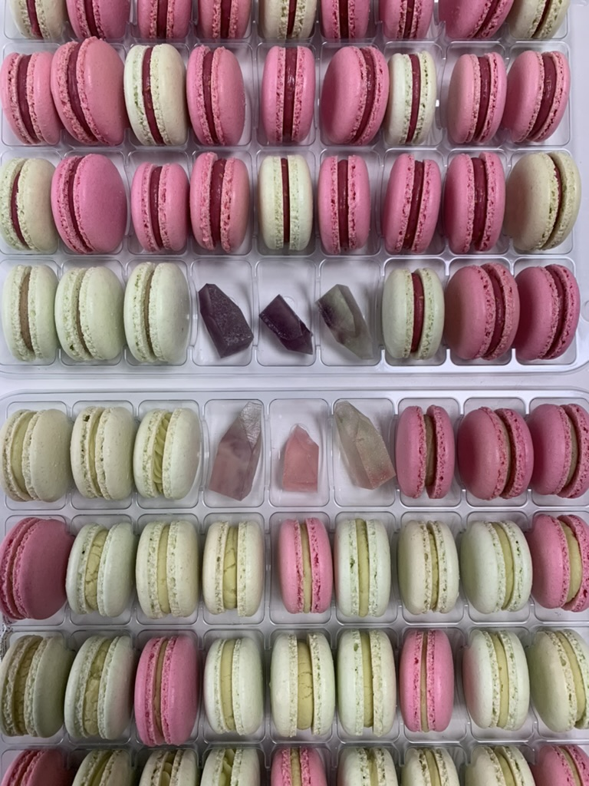

# GIT kuchařka kurzu DA testování

## Tatarák z olomouckých tvarůžků

### Suroviny
* 200 g olomouckých tvarůžků
* 1 větší cibule
* 100 g másla
* 1 lžička hořčice
* 1 stroužek česneku
* 1 lžička sladké papriky
* 1 lžička chilli (nemusí být)
* 2 syrové žloutky

### Postup přípravy
1. Máslo utřeme s nastrouhanými tvarůžky do pěny.
2. Přidáme nadrobno nakrájenou cibuli, papriku, hořčici, čili a natřený česnek a žloutky.
3. Vše promícháme a podáváme na opečeném, očesnekovaném chlebu s dobře vychlazeným pivem.

Přeji dobrou chuť. Konzumaci nedoporučuji před důležitou schůzkou, pokud tedy není online :-)

_Autor: Jan Přibyslavský_

---

## Shakshuka

### Suroviny
* 2 lžíce podmáslí nebo oleje
* 4 vejce
* 1 konzerva loupaných rajčat (v sezóně 400 g čerstvých rajčat)
* 1 konzerva fazolí v rajčatové nebo chilli omáčce
* 2 stroužky česneku
* 1 lžička římského kmínu
* 1 lžička sladké nebo uzené papriky
* 1 lžička chilli (nemusí být)
* čerstvá petrželka nebo koriandr
* sůl
* pepř

### Postup přípravy
1. V pánvi na podmáslí či oleji nechte zesklovatět cibuli nakrájenou na malé kostičky.
2. Přidejte drcený česnek a nechte rozvonět.
3. Přisypte koření a pár vteřin za stálého míchání opečte.
4. Přidejte rajčata a fazole, osolte a opepřete.  
5. Duste pod pokličkou na mírném plameni za občasného promíchání cca 15-20 minut.
6. Nakonec ve směsi vytvořte důlky a rozklepněte do nich vejce.
7. Za mírné teploty nechte bez míchání směs probublávat, dokud bílek neztuhne, ale žloutek zůstane krásně tekutý.
8. V případě, že máte raději vejce kompletně provařená, pánev zakryjte pokličkou a směs nechte dusit, dokud vejce neztuhnou.
9. Na stůl podávejte v pánvi, aby si každý mohl nabrat, posypané nasekanou čerstvou petrželkou nebo koriandrem.

PS: Kdo se nevyhýbá mléčným výrobkům, může do směsi spolu s vejci přidat i trošku nahrubo rozdrobené fety.

_Autor: Internet s menší úpravou od Tereza Káčerková_

---

## Hovězí tokáň

### Suroviny
* 1 kg hovězího krku 
* 4 stroužky česneku 
* 2 střední cibule 
* 2 lžíce sádla 
* 2 lžíce rajčatového protlaku 
* 1 lžička soli 
* 1 lžička mletého pepře 
* 2 lžíce hladké mouky 
* 400 ml suchého bílého vína 
* 1,5 l hovězího vývaru

### Postup přípravy
1. Maso nakrájej na nudličky.
2. V hrnci na střední teplotu rozpal sádlo, vlož nakrájenou cibuli a 15-20 minut restuj do zlatohnědé barvy.
3. Zvyš teplotu, přidej maso, restuj do zlatohnědé barvy.
4. Přidej protlak a minutu míchej.
5. Sniž teplotu, přidej lisovaný česnek, osol, opepři, zapraš moukou a minutu za stálého míchání restuj.
6. Přilij víno a za stálého míchání nech vyvařit.
7. Zalij vývarem, aby maso převyšoval o 1 cm.
8. Přiveď k varu, sniž teplotu na minimum, přiklop pokličkou a nech dusit 15 minut.
9. Zamíchej, přidej vývar aby bylo maso do poloviny ponořené.
10. Opakuj, než je maso měkké. Dochuť solí.

_Autor: Kateřina Bajerová_

---

## Tvarohový koláč s jahodovou omáčkou

### Suroviny

#### Na těsto:
* 200 g hladké mouky
* 100 g másla
* 80 g moučkového cukru
* 1 vejce
* 1 špetka soli

#### Na náplň:
* 500 g měkkého tvarohu
* 100 g krupicového cukru
* 2 vanilkové pudinky
* 2 vejce
* 1 citronová kůra
* 2 lžíce mléka

#### Na jahodovou omáčku:
* 250 g jahod
* 100 g cukru
* 1 lžíce citronové šťávy
* 1 lžička škrobu

### Postup přípravy

#### Těsto:
1. Mouku smícháme se solí a cukrem.  
2. Přidáme studené máslo nakrájené na kostky a rozdrobíme ho s moukou na hrubou směs.  
3. Vmíchame vejce a vypracujeme hladké těsto.  
4. Těsto zabalíme do fólie a necháme v lednici odpočinout asi 30 minut.

#### Náplň:
1. Tvaroh smícháme s cukrem, vanilkovým pudinkem, vejci, citronovou kůrou a mlékem.  
2. Vypracujeme hladkou tvarohovou hmotu.

#### Jahodová omáčka:
1. Jahody omyjeme, odstopkujeme a rozmixujeme na pyré.  
2. Pyré smícháme s cukrem, citronovou šťávou a škrobem.  
3. Za stálého míchání zahřejeme do varu a vaříme asi 2 minuty, dokud omáčka nezhoustne.

### Sestavení koláče:
1. Troubu předehřejeme na 180 °C.  
2. Těsto rozválíme na tenký plát a vložíme do vymazané a vysypané koláčové formy.  
3. Na těsto nalijeme tvarohovou hmotu a uhladíme.  
4. Koláč pečeme asi 45 minut dozlatova.
5. Po upečení necháme koláč vychladnout a poté ho polijeme jahodovou omáčkou.

Přeji dobrou chuť.

_Autor: Anna Balitska_

---

## Poctivá rajská omáčka s masovými koulemi

### Suroviny
* mleté maso
* vejce 1 ks
* strouhanka 2 lžíce
* čerstvě namletý pepř
* sůl 1/2 lžičky
### Omáčka
* máslo (nebo ghí) 60 g
* hladká mouka (nebo hraška pro bezlepkovou verzi) 50 g
* cibule 1 ks
* loupaná rajčata (stačí konzerva) 400 g
* vývar (hovězí či drůbeží) 800 ml
* mletá skořice 1/2 lžičky
* bobkový list 1 ks
* nové koření 5 kuliček
*  sušený tymián 1/2 lžičky
*  rajský protlak 140 g
*  ocet (na dochucení)
*  cukr (na dochucení)
*  pepř celý 5 kuliček

### Postup přípravy
1. Masové koule: Všechny ingredience kromě strouhanky/kukuřičné krupice vložte do mísy a pečlivě promíchejte.
2. Pokud jdou ze směsi tvořit koule, které se nerozpatlávají a drží tvar, můžete rovnou tvarovat koule o velikosti ping-pongového míčku. Pokud je směs příliš řídká, přidejte strouhanku/kukuřičnou krupici.
3. Masové koule vyskládejte na tác a připravte omáčku.
4. Omáčka: Cibuli nasekejte najemno. V hrnci rozpusťte máslo, přihoďte cibuli a restujte dozlatova.
5. Snižte plamen a cibuli zasypejte moukou (hraškou) a asi minutu opékejte. Přidejte rajčata, promíchejte a směs zalijte vývarem.
6. Přidejte bobkový list, pepř, nové koření, tymián a skořici, osolte a přiveďte k varu.
7. Pak do omáčky přidejte připravené masové koule, zlehka promíchejte, přikryjte pokličkou, snižte plamen a duste 45 minut.
8. Po stanoveném čase vyjměte maso z hrnce. Zbylou omáčku přes síto přeceďte a na plamen už nevracejte. Přidejte do ní rajský protlak a drátěnou metličkou promíchejte. Dochuťte octem a cukrem – obvykle stačí 1 lžíce octa a 3 lžičky cukru, ale každý se řídí vlastní chutí.
9. Masové koule vraťte do omáčky, aby dále nechladly. Podávejte s těstovinami, rýží nebo houskovým knedlíkem.

_Autor: Gabriela Bémová_

---

## Čokoládovo-banánový chlebíček s tahini pastou

### Suroviny
* 2 přezrálé banány  
* 60 ml klasického olivového oleje  
* 60 ml tahini  
* 1 vejce v pokojové teplotě  
* 100 g cukru krystal  
* 60 g hladké pšeničné mouky  
* 25 g kakaa  
* 2 g soli  
* 2 g sody  
* 100 g hořké čokolády (pecky nebo nakrájené na malé kousky)
* sezamová semínka na posypání

### Postup přípravy
1. Troubu předehřej na 170 stupňů (horkovzduch na 150 stupňů).
2. Formu (moje byla 30 x 12 cm) vylož pečícím papírem.
3. V míse rozmačkej banány a přimíchej olej s tahini pastou. Poté do směsi přidej vejce s cukrem a opět promíchej.
4. Ve vedlejší míse promíchej mouku, kakao, sodu a sůl.
5. Suchou směs postupně přidávej do mokré směsi. Jakmile je směs propojená, přidej kousky čokolády.
6. Hotové těsto přendej do formy a vrch posypej sezamovými semínky.
7. Peč 45 až 50 minut. Je nutné ale průběžně kontrolovat. Vrch je možné přikrýt alobalem či pečícím papírem, aby se nespálila semínka.
8. Upečený chlebíček vyndej ještě teplý z formy a nech vychladnout do druhého dne. Krájej druhý den.

_Autor: Šárka Kozmanová_

---

## Tradiční korejské kuře v pálivé omáčce
**POZOR! Extrémně palívé!**

### Suroviny
* 1 kg celých kuřecích stehen
* 1/4 hrnku sojové omáčky
* 1/4 hrnku česneku
* 1/4 hrnku korejské chilli pasty Gochujang
* 1/4 hrnku korejských chilli vloček Gochugaru
* 1 lžíce cukru
* 2 hrnky cibule
* 600 g brambor
* 2 stonky jarní cibulky
* 500 ml vody
* volitelné: 2 zelené chilli papričky

### Postup
* Připravte si středně velký hrnec.
* Kuřecí stehna naporcujte na spodní a vrchní část. Vložte do hrnce.
* Oloupejte česnek, nakrájejte/prolisujte a vložte do hrnce.
* Přidejte do hrnce nahrubo nakrájenou cibuli.
* K surovinám v hrnci vsypte lžíci cukru.
* **Důležitý krok - dávkování chilli vloček a chilli pasty**: Jednou jsem připravila recept s dávkou chilli uvedené v surovinách a myslela jsem, že se mi to jídlo propálí tělem skrz naskrz :D Osobně volím poměr 1/4 hrnku chilli pasty a chilli vloček podle voka, ale maximálně tak 1/8 hrnku, tedy půlku dávky z rozpisu. A i tak je to dost pálivé. Vámi zvolenou nesrmtelnou dávku chilli přidejte do hrnce.
*  Přilejte 500 ml vody.
* Hrnec postavte na sporák a vařte na středně vysokém stupni 20 minut od doby, kdy tekutiny začaly vřít.
* V mezičase oloupejte a opláchněte brambory, a nakrájejte na poměrně velké kostky (klidně i 5 cm/strana). Později se budou vařit minimálně 20 minut se zbytkem, tak ať se Vám nerozvaří. Dejte stranou.
* Pokud jste zvolili verzi, kdy chcete zabít sebe, Vaše přátelé a rodinu a hlavně záchod, tak nakrájejte zelené chilli papričky na kusy dle Vašich preferencí. Dejte bokem.
* Jarní cibulku nakrájejte na drobná kolečka. Odložte bokem.
* Poté, co se směs v hrnci vaří 20 minut, přidejte brambory a zelené chilli. Nechte vařit dalších 20 minut pod poklicí.
* Je vhodné občas zkontrolovat stav tekutin a promíchat. A také upravit teplotu sporáku, pokud tekutina opouští prostor hrnce skrz škvýru mezi poklicí a hrncem.
* Po 20 minutách poklici oddělejte a nechte ještě pár minut (chápejte, 3 - 5 ) povařit, aby se omáčka ještě trochu zredukovala.
* A máte hotovo, oddělejte ze sporáku, posypte jarní cibulkou a podávejte s rýží.

_Autorka: Lucie Pohl Sladká, originální recept zde: https://www.maangchi.com/recipe/traditional-dakbokkeumtang_

-----------------

## Čočkový dhal

### Suroviny
* 200g červené čočky
* 1 stroužek česneku
* kousek zázvoru
* 1 červená chilli paprička (nemusí být)
* 1 lžíce kokosového oleje
* 1 lžička kurkumy
* 1 lžička sušeného koriandru
* 1 lžička kari koření
* 1 lžička římského kmínu
* 1 lžička koření garam masala
* 2 lžíce rajčatového protlaku
* 500ml zeleninového vývaru
* 200ml kokosového mléka
* sůl
* čerstvě mletý kampotský pepř
* lístky koriandru na ozdobu

### Postup přípravy
1. Čočku dejte do misky a promyjte ve studené vodě alespoň třikrát.
2. Česnek a zázvor oloupejte. Česnek a chilli papričku nakrájejte nadrobno, zázvor nastrouhejte.
3. V pánvi rozpalte kokosový olej, vložte do něj česnek a nechte ho krátce zpěnit, asi půl minuty, přidejte zázvor a chilli papričku, promíchejte.
4. Hned přidejte veškeré suché koření a za stálého míchání nechte rozvonět, asi 1 minutu.
5. Přidejte rajčatový protlak, zarestujte asi 1 minutu, přilijte zeleninový vývar, přidejte promytou čočku a promíchejte. Přiveďte k varu a pod pokličkou vařte 15 minut.
6. Čočku ochutnejte, jakmile je al dente, přilijte kokosové mléko, promíchejte a vařte dál bez pokličky 10 až 15 minut, dokud nedosáhne kašovité konzistence. Čočka má být mírně rozvařená.
7. Dochuťte solí a pepřem. Odstavte a servírujte na talíře posypané čerstvým posekaným koriandrem s chlebem rotti nebo s rýží.

Recept je na 4 porce.

_Autor: Viola Ježek_

---

# French Macarons

## Ingredients
* 200 g [almond flour](https://www.diana-company.cz/mouka-z-loupanych-mandli-x-fine-500g/)

* 200 g confectioner`s sugar

* 135 g egg whites - room temperature

* 270 g caster sugar

* 80 g water

* [GEL color](https://www.diana-company.cz/vyhledavani/?string=gelov%C3%A9%20barvivo) of your choice

## Method

- Weight all ingredients
- Preheat the oven to 160°C.
- Sieve almond flour and confectioner`sugar together in a large bowl. Weight again and make sure, mix is exactly 400 g.

- In another large bowl (or kitchen robot bowl) prepare egg whites for meringue.

- Mix 270 g of caster sugar with 80 g of water and put on the stove on medium heat. Put in the thermometer, sugar syrup should be exactly 116°C.
- When temperature hits 113°C start beating egg whites.

- The moment the temperature hits 116°C start pouring sugar syrup into egg whites. It is absolutely necessary to pour the sugar syrup slowly and along the inner side of the bowl to avoid caramel crystals to appear. 

- Beat the egg whites for 10 minutes at medium speed until stiff peaks.
Stiff peaks means, when you lift whisking beaters stiff peaks do not drop down but stay long and sharp. Meringue is done.

- Now is the time to add gel food coloring if using only one color. Add a few drops and mix until color is well mixed.

## Macaronage

Next step is to mix meringue with almond flour mix. When you search for other recipes, you will find recommendations to add almond flour into meringue in three additions. I personally do not recommend but add all at once while starting with macaronage immediately.

[Macaronage](https://www.youtube.com/watch?v=hTOpHaKocUs&ab_channel=ShineeD) is a key technique used in making French macarons. It refers to the process of mixing the meringue with almond flour mix to achieve the perfect batter consistency.

The goal is to fold the mixture just enough to make it smooth and shiny, without over-mixing. It should flow like lava: when you lift the spatula, the batter should form [ribbons](https://www.youtube.com/shorts/6VdncUMtf1A) that slowly settle back into the bowl after about 10-20 seconds. 

The right texture is crucial for the macarons to develop their signature smooth tops and "feet" during baking.
It usually takes a few minutes to get the perfect texture and it is necessary not undermix or overmix. I recommend search for Youtube video for reference on how to macaronage properly.

## Piping

You will need a baking sheet turned upside down and a [silicone macaron mat](https://www.kulina.cz/silikonova-podlozka-na-makronky-se-znackami-40-x-30-cm/) made of fiberglass. Why? Because it conducts heat well, and the circles for the macarons are pre-drawn on it. Same goes for the baking sheet. It needs to be flipped to allow for proper circulation of hot air in the oven.

Transfer the batter into a sturdy piping bag and cut the tip to about 1 cm wide. Then [pipe](https://www.youtube.com/watch?v=3iJJtEbVVks&ab_channel=ShineeD) individual macarons, stopping the batter just before the pre-drawn circle. I don’t recommend piping the macarons too close to the edges of the baking sheet.

Once the macarons are piped, it’s important to sharply hit the baking sheet against the table several times to release air bubbles from the batter and to level the surface.

## Baking

Baking is the most tricky phase of macarons making. You have to know your oven really well.

Place the sheet in an oven preheated to **160°C** for 1,5 minutes. Then open the oven, turn the sheet around, and bake again at 160°C for another 1,5 minutes. 

At this point, the macaron’s “feet” are forming. If baked at too high a temperature for too long, the batter would rise too much, and later on, it would spread out and form a "skirt" around the edges. If baked for too short a time, the “feet” wouldn't form at all.

After these 3 minutes, open the oven wide, lower the temperature to **145°C**, turn the sheet, and close the oven door, leaving a wooden spoon or something similar in the door to keep it slightly open. 

Bake for 5 minutes. Then, turn the sheet again and bake for another 5 minutes at 145°C. During the final minutes, open the oven more frequently and check by touch to see if the macaron shells are firm.

Remove the sheet from the oven and let it cool completely before removing the shells from the mat. Meanwhile, preheat the oven again to 160°C and prepare for the next batch. 

The batch will yield approximately 4-6 trays and around 70 pairs of macaron shells. Once the macarons have cooled, you can pair and fill them as desired.

## Tips and tricks

### Egg whites
It helps a lot to “age” egg whites a little. 

How to do it: prepare egg whites a few days in advance and leave them in a box at room temperature like for 1 to 5 days. 

This process will help to make egg whites more fluid, which helps a lot with later weighing.

### Extra fine almond flour mix

To achieve perfect texture it is recommended to run the mix with a food processor. This additional process will make almond flour mix finer and the final batter smoother.

### Adding color
Safest is to add color into whisked egg whites during beating, but if using more than one color you can separate batter during the macronage process, right before the end of the process. 

To be able to do this correctly you have to know exactly in what stage of the macronage process you are and this comes with experience. 

>_Author: Klára Kratochvílová_
> 
>See recipe with images here

